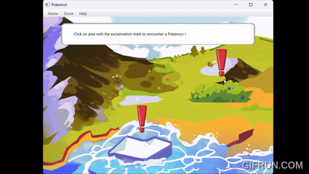
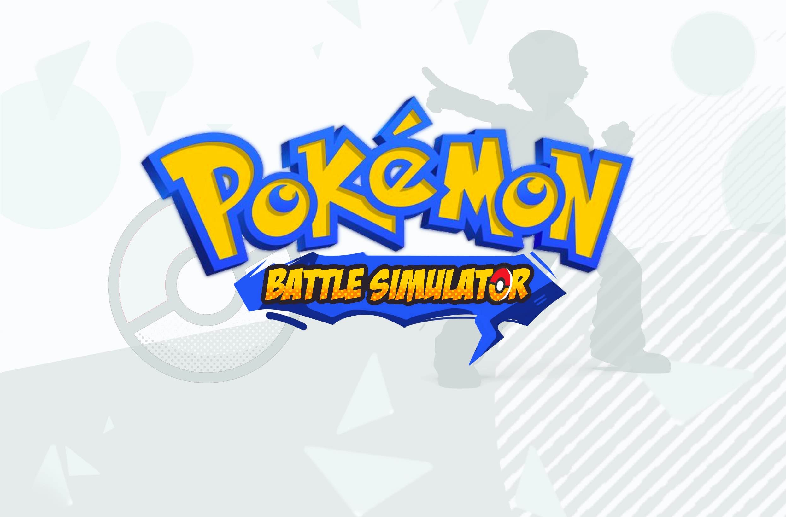

## Pokemon Battle Simulator 
Pokémon Battle Simulator is an interactive game project that aims to recreate the experience of a Pokémon game entirely in Scala. 

Watch the GamePlay Demo of [ Pokemon Battle Simulator](https://youtu.be/krTyYFWdL6Q?si=PRNvsyqJTURG3pLR)

### Overview
In this simulator, players start by selecting two randomized starter Pokémon from three available Pokéballs. Players can then explore various map areas where random Pokémon will appear for battle. During battle, players must select the most effective move to and defeat the pokemon to get the highest score. It will be a turn-based battle mechanic, which the opposing pokemon will also have a counterattack. The Pokémon that deafeats first wins !

### Features
#### Score System:
A scoring system feature is implemented so that players can challenge each other to beat their highscore.

#### Hand-drawn Visuals
The game includes a variety of images, GIFs, and animations, most of which are hand-drawn and inspired by the retro aesthetics of old Nintendo games.
### Assets
* **Pokémon sprites:** Extracted from [Project Pokémon.](https://projectpokemon.org/home/docs/spriteindex_148/3d-models-generation-3-pok%C3%A9mon-r92/)
* **SFX:** Home Screen BGM extracted from [Pokémon Game Sound Library](https://www.youtube.com/watch?v=Q53CDIGPJ58&t=2600s)
* Attacker Pokémon BGM extracted from [OfficialVGM.](https://youtu.be/gxotUOjOhQ0?si=g-q3cgOaVXISj1oM)
* Defender Pokémon Selection BGM extracted from [BrawlBRSTMs3 X](https://youtu.be/zRGCzCn5azI?si=6kihC5LsSnOcci7O)
* Battle Mode BGM extracted from [TheNintendoReviewer](https://youtu.be/LgK2f47q8cU?si=oVwnbYl5qKUxM9v_)
  

